# Set up the project for Windows
<!-- TOC -->
* [Set up the project for Windows](#set-up-the-project-for-windows)
* [Set up the environment](#set-up-the-environment)
  * [Download and install Python](#download-and-install-python)
  * [Download and install Poetry](#download-and-install-poetry)
  * [Download and install an Integrated Development Environment (IDE)](#download-and-install-an-integrated-development-environment-ide)
* [Create the project for test libraries](#create-the-project-for-test-libraries)
  * [Initialize the project](#initialize-the-project)
  * [Open the project in IDE - PyCharm](#open-the-project-in-ide---pycharm)
  
* [Create new test cases](#create-new-test-cases)
<!-- TOC -->

# Set up the environment
## Download and install Python
Download `Windows installer (64-bit)` from [Python official website](https://www.python.org/downloads/). Recommended to follow the configs below:
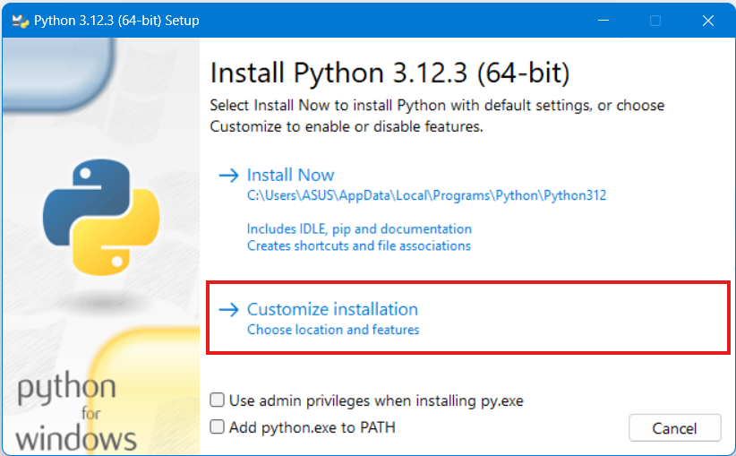
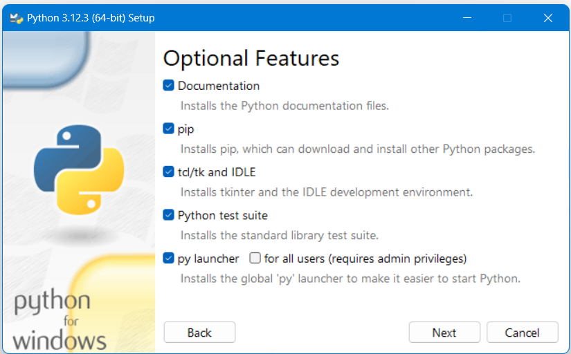
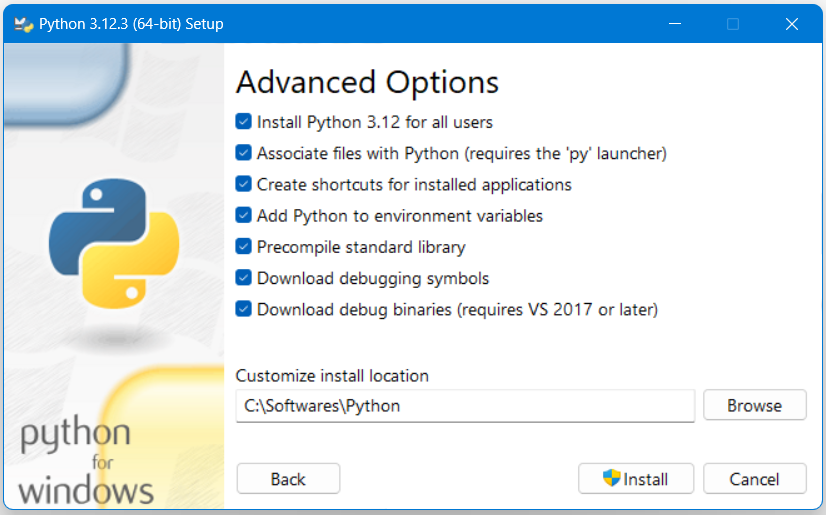

Can check the setup by go to the system environment variables

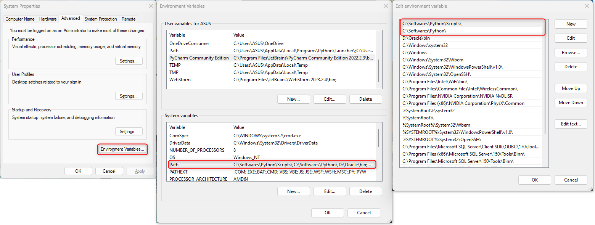

If these system variables do not add in `Path`, you can add two paths directly same as above image, or you can add it by using the command:

`$Env:Path += ";C:\Softwares\Python\;C:\Softwares\Python\Scripts\"; setx -m PATH "$Env:Path"`

## Download and install Poetry
Poetry is a modern tool for package management in Python that simplifies the process of creating, managing, and publishing Python packages.

The way to install Poetry is with the support of `pipx`, which takes care of creating and maintaining isolated virtual environments for command-line Python applications.

`python -m pip install pipx`

Now, install `poetry` by using `pipx`

`pipx install poetry`

This command will install Poetry into a dedicated virtual environment that won't be shared with other Python packages.

`pipx` will set an alias to the poetry executable in your shell so that you can invoke Poetry from any directory without manually activating the associated virtual environment.

Run the command to executable path for poetry:

`pipx ensurepath`

Once the installation process is completed, you can verify that Poetry is installed correctly by executing the following command:

`poetry -- version`

Also, install the virtual package enables the creation of isolated local virtual environments for Python projects. Virtual environments help avoid package conflicts and enable choosing specific package version.

`pipx install virtualenv`

## Download and install an Integrated Development Environment (IDE)
Download PyCharm Community Edition as the IDE for Pure Python Development
from https://www.jetbrains.com/pycharm/download/?section=windows
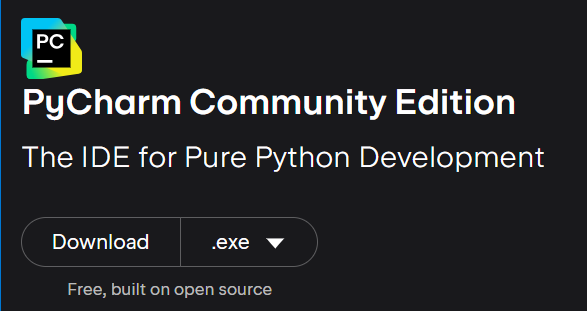

# Create the project for test libraries
## Initialize the project
* Create new project by using the command following format < project's folder name > and < first package >, for example:

`poetry new robot-fwk-python --name practice-expand-testing`

* If the first package name is same as the project name, skip `--name`
* If you have created an empty directory, using the below command to create the first package

`poetry init --name practice-expand-testing`

For this project, I've created the project before, so I will use the second command to create the first package.
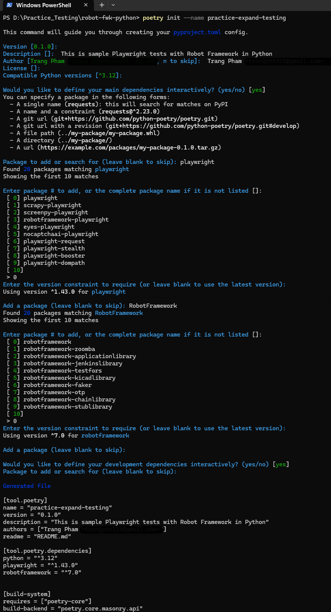
And in this step, I also add some packages to the project, such as `robotframework`,`playwright`.

You also can add more packages to the project by using the command `poetry add <package_name>` (I will show you how to do it below in "Open the project in IDE - PyCharm" ).

* Configure the virtual environment in the project, and create it automatically if it isn't exist

`poetry config --local virtualenvs.create true`

`poetry config --local virtualenvs.in-project true`

For any `config --local` it will be added to `poetry.toml` which is the local configuration file for Poetry instances.

To read `pyproject.toml` file from the current project, resolve the dependencies, and install them

`poetry install`

# Note:

After run the command `poetry install` then we got an error about not found the package 'practice-expand-testing' and also don't have `.venv` folder.
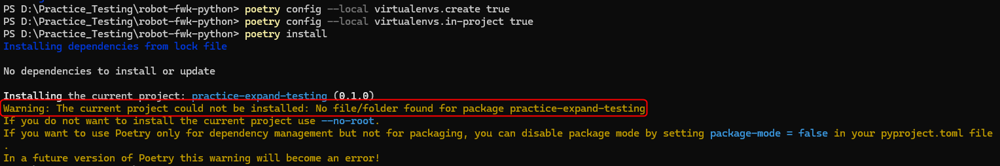

* First we need to create the package file "practice_expand_testing" with a simple `.py` file. Since the command `poetry init --name practice-expand-testing` is only added in `py.project.toml` file. The package file should be created manually and the name should use "_" instead of "-". 

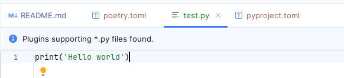

* Second we need to check the virtual environment in the project by using the command:
`poetry env info --path`.
Then, we can see the virtual environment is created in another path, not under the project folder. So, we need to move it to the project folder by using the command `del <path>`
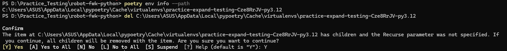

* Finally, we need to create the virtual environment in the project by using the command `poetry install` again. Then, the `.venv` folder will be created in the project folder.
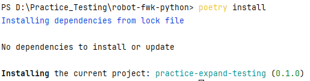

# Open the project in IDE - PyCharm
With the virtual env created in the project by Poetry, once the project is opened in IDE, the IDE can configure the base interpreter by using .venv itself.

We created and successfully activated the project with the isolated virtual environment. We can add more dependencies to the project via Poetry command add.

For example, if the project is empty, and you are starting from scratch, run the `poetry add` command below one by one to install these essential libraries. Or you can add it to `pyproject.toml` under section `[tool.poetry.dependencies]`, then perform `poetry install` once.

`poetry add robotframework`

`poetry add playwright`

`poetry add robotframework-pythonlibcore`

`poetry add selenium`

I've already added the packages of `robotframework` and `playwright` above. So, at this step, I will add the rest of the packages to the project.

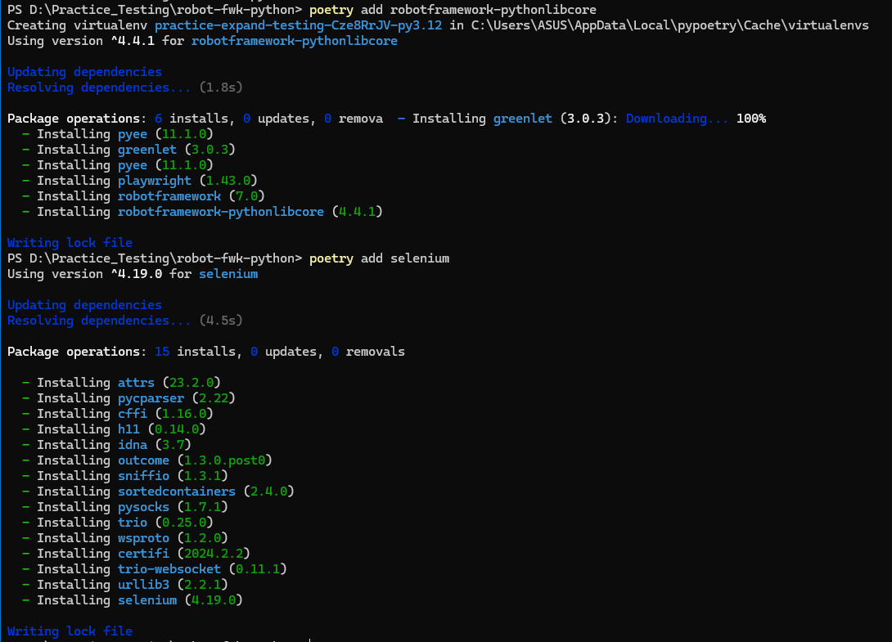

Those dependencies will be installed in project `.venv`.

If you decide to set up the same project on another machine, you can install the dependencies by using the command:

`poetry install`

So, now we just need to install Python, poetry, and no need to add packages one by one. Just run the command `poetry install` to install all the dependencies in the project.

Save the project dependencies to `requirements.txt` file by using the command:

`poetry export --without-hashes --format=requirements.txt --output=requirements.txt`

The `requirements.txt` file will be created in the project root folder. This file will support users if they want to use `pip` instead of `poetry` to install the dependencies.

`pip install -r .\requirements.txt`

After run this command, the user can install the dependencies in the project by using `pip` instead of `poetry`.

* NOTE:
We should export the requirements file after adding new packages to the project. Because the `requirements.txt` file will be overwritten with the new dependencies.

Create a `git.ignore` file in the project root folder to ignore the `Virtualenv` folder `.venv` and `poetry.lock` folder.

`.venv/`
`poetry.lock`
`.idea/`

# Create new test cases
We need to add another package to integrate with Playwright. Following to https://robotframework.org/, they have the new library that supports for Playwright
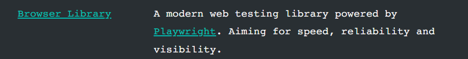

Run the command `poetry add robotframework-browser` to add the new library

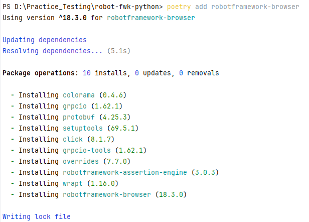

We need to activate the virtualenv in the project before running the robot command. If we don't activate the virtualenv, the robot command will not be recognized.

`.\.venv\Scripts\activate`

Check the robot version

`robot --version`

Initialize robot browser with playwright

`rfbrowser init`

Command to run a test in file test.robot

`robot test.robot`

## Add .yml file for elements
Create a new file `caloriesTrackerElements.yml` in the project folder to store the elements of the page. This file will be used to store the locator of the elements in the page.
You need to install the package `pyyaml` to use the yaml file in the project.

`poetry add pyyaml`

